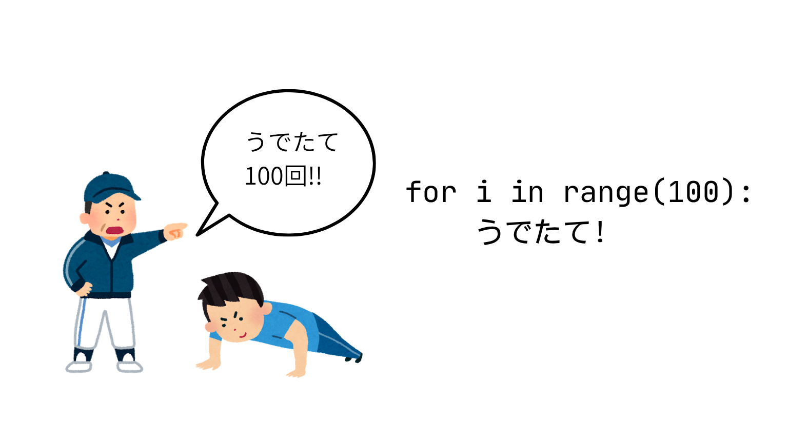
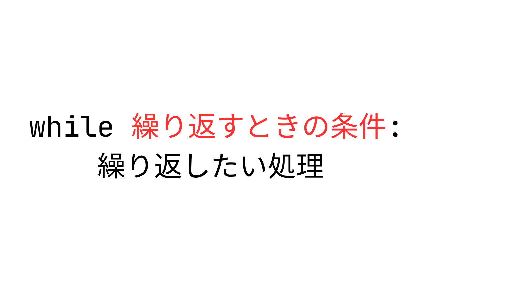
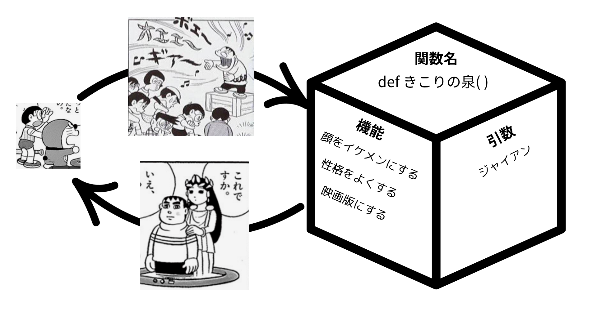
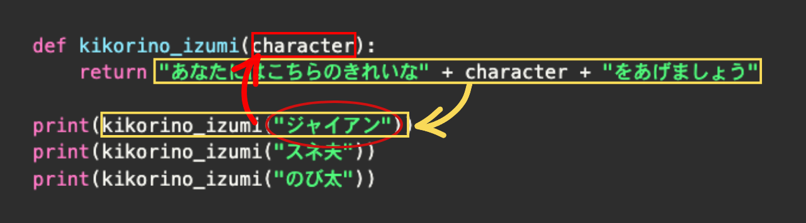

# day2 Pythonの基礎② 制御構文･関数 ／ pyxelの基本
プログラムは基本的に上から下に順番に実行されるけど、それだけだと一本道の単純な処理しかできない。時には「もし〇〇だったら、この処理をする」「この処理を10回繰り返す」のように、**処理の流れをコントロールする(制御する)**必要がある。

これを可能にするのがpythonの**制御構文**。

## 1. 制御構文①: `if(イフ)` もし〜なら (条件分岐)
  <!-- top -->
  
  例えば、エアコンの新機能を作るとする。室内を最適な温度に保ちたいわけだけど、いちいち温度設定をしたり、冷房と暖房を切り替えたりするのがめんどくさい！ていう悩みを解決してみよう。

  - ### プログラムを日本語で表現してみよう
    今回書きたいコードを日本語で表現してみると、こんな感じ

    ```
    もし　室内温度が　２５度以上だったら
    　　「冷房オン」とprint
    そうじゃなくて　室内温度が　１０度以下だったら
    　　「暖房オン」とprint
    どっちでもなかったとき
    　　「電源オフ」とprint
    ```

  - ### `if` = 「もし〜なら」
    ifを使った条件分岐の書き方はこんな感じ

    ```python
    if 条件:
        やりたいこと
    ```

    今回の場合、この「条件」のところに「室内温度が　２５度以上だったら」などの条件が入るわけだけど、その部分をどう書くかが問題。
    
    「２５」という指定された数字と、実際の室内温度を比較する必要がある。

  - ### 比較演算子
    算数・数学でいうところの大なり（＞）とか小なり（＜）のプログラミング版の書き方。

    | 比較演算子 | 意味                      |
    | :--------: | :------------------------ |
    |   **==**   | 等しい (イコールふたつ！) |
    |   **!=**   | 等しくない                |
    |   **>**    | より大きい                |
    |   **<**    | より小さい・未満          |
    |   **>=**   | 以上                      |
    |   **<=**   | 以下                      |

    これをpythonコードに落とし込んでみよう
    仮に、室内温度＝room_tempを、１８度としようか。

    ```python
    room_temp = 18

    #室内温度が２５度以上だったら「冷房オン」とprint
    if room_temp >= 25:
        print("冷房オン")
    ```

    ※　コードの中の　#　で始まる行は「コメント」といって、プログラムには関係のない行として無視されます。どんな処理をしているかのメモを残したりするときに使います。

  - ### `elif` と `else`
    複雑な条件分岐を書くときは、条件が２つ以上になる。今回の条件は

    ```
    ①室内温度が２５度以上
    ②室内温度が１０度以下
    ③　①②以外（１０度より高く、２５度未満）
    ```

    の３つ
    `elif` は、条件分岐のなかにいくつでも追加できる。２つめ、３つ目の条件を追加するときに追加するやつ
    `else` は、その上にあるどの条件にも合致しないときに実行する処理を書くときにつかうやつ。他の２つと違ってこの場合は条件を書く必要がない
    elif elseを使うバージョンの条件分岐の書き方はこんな感じ。

    <!-- top -->
    


    これを使って、エアコンプログラムを完成させてみよう

    ```python
    room_temp = 18

    # 室内温度が２５度以上だったら「冷房オン」とprint
    if room_temp >= 25:
        print("冷房オン")
    # 室内温度が１０度以下だったら「暖房オン」とprint
    elif room_temp <= 10:
        print("暖房オン")
    # そのどちらでもなかったときに「電源オフ」とprint
    else:
        print("電源オフ")
    ```

## 2. 制御構文②: `for(フォー)` 〜回くりかえす (回数指定の繰り返し)
  
  コードを書くときのとても重要な考え方として、「コードをわかりやすく、短くまとめる」というのがある。

  真夏の体育館での校長先生の話を考えてみよう。５分ですむ話を、１時間も２時間もされたら、たまったもんじゃないよね。でも大体校長先生の話とかって「挨拶をしようね」「礼儀正しくしようね」ってだけの内容の事が多い（気がするｗ）
  プログラミングをしていくうえで、「おんなじことを何回も繰り返し実行したい」っていうシーンは結構ある。

  プログラミングもおんなじで、短く書くことができるのに、それをわざわざながーーーーく書くことは良くないとされている。pythonの制御構文を使って、シンプルに読みやすく書くようにしよう。

  - ### 繰り返しを使わずに書いてみよう
    例えば

    - クラスの全員に対して個別でLINEを送りたい（＝クラスの人数分繰り返しLINEを送る）
    - 右ボタンが押されている限り繰り返しキャラクターを右に移動させたい

    １つ目のLINEの例を考えてみよう。

    たとえばクラスが１００人いたときに、コードはこんな感じ（実際にはlineを送る処理はもっと複雑だけど）

    ```python
    print("LINEを送信")
    print("LINEを送信")
    print("LINEを送信")
    print("LINEを送信")
    print("LINEを送信")
    print("LINEを送信")
    print("LINEを送信")
    print("LINEを送信")
    ・・・
    # これを１００人分繰り返す
    ```

  - ### `for` = 「〜回くりかえす」
    こんな感じで、**回数が決まっている**（今回は１００回）繰り返しは、pythonではこう書きます。

    

    これをもとに、さっきのLINE送信プログラムを書いてみると

    ```python
    for i in range(100):
        print("LINEを送信")
    ```

    <details markdown="1">
    <summary>参考：i とか range とかって何なのよ</summary>

    このコードを動かしてみよう

    ```python
    for i in range(10):
        print(i)
    ```

    実行結果↓

    ```
    0
    1
    2
    3
    ...(省略)
    9
    ```

    range(10)とすると、０から９までの数字データのかたまり（配列といいます）が入って、for文といっしょに使うことで、処理中にその塊に入っているデータに順番にアクセスしていく感じ。０から９だから、全部で１０回の繰り返しになる、てこと。iという文字に、繰り返しごとにデータが順番に入っていく感じ。ここの文字は別にiである必要はなくて、自由に名前をつけられる。
    配列には他にも「リスト」などの種類があって、こっちは数字だけじゃなくて文字も扱える。
    配列を使った繰り返しの例はこんな感じ

    ```python
    teacher_list = ["リッキー", "オッキー", "ガッキー", "グッチー"]
    for teacher in teacher_list:
        print(teacher + "かっこいい")
    ```

    実行結果↓

    ```
    リッキーかっこいい
    オッキーかっこいい
    ガッキーかっこいい
    グッチーかっこいい
    ```
    </details>

## 3. 制御構文③: `while(ワイル)` 〜の間くりかえす (条件指定の繰り返し)
  
  for文は回数指定の繰り返しだけど、例えばこんなとき、何回繰り返すことになるかわかんないよね
  - 気温が３０度以上である限りスプリンクラーを撒き続ける
  - 「おわり」と指示するまで仕事をやめないロボット
  - 「君がッ 泣くまで 殴るのをやめないッ」
    

  これらは回数じゃなくて**条件**によって繰り返すかどうかを制御する必要がある。

  - ### `while` = 「〜の間くりかえす」
    while文の繰り返しの書き方はこんな感じ

    

    試しに、「君がッ 泣くまで 殴るのをやめないッ」を、pythonで実装してみよう。
    inputという特殊な関数を使って、ユーザーが文字を入力して、「ぴえん」という文字を入力したときだけ処理が終了して許してもらえるというプログラム。

    ```python
    dio = ""
    while dio != "ぴえん":
        print("オラ!")
        dio = input("dio:")
    print("ゆるしてやろう")
    ```

    ここでもインデントが重要で、インデントされている2つの処理が繰り返し実行される処理、インデントされていない print("ゆるしてやろう") の部分は、繰り返し=while文が終了したあとに実行されることがわかる。

    <details markdown="1">
    <summary>参考①True(トゥルー)とFalse(フォルス)</summary>

    試しにこのコードを実行してみよう。

    ```python
    ricky = "かっこいい"
    print(ricky == "かっこいい")
    ```

    実行結果

    ```
    True
    ```

    True : 正しい
    pythonも認めざるを得ないかっこよさ。
    冗談はさておき、これは `ricky という変数と "かっこいい" という文字データは同じ` という条件が「正しい」ので、Trueという結果が返ってきている感じ。
    逆に

    ```python
    ricky = "かっこいい"
    print(ricky == "ブサイク")
    ```

    コレを実行してみると

    ```
    False
    ```

    という結果がでます。(False=フォルス:間違い)

    今まで出てきたif文やwhile文は、「条件」が「TrueかFalseか」を判定しているわけ。例えば

    ```python
    if ricky == "イケメン":
        print("わかるー")
    ```

    というif文は、`ricky == "イケメン"`という条件がTrueのときに「わかるー」とprintする、という感じになる。ちなみに、パソコン内部的にはTrueは1、Falseは0として扱われるので、最初に出てきた「パソコンは0と1だけでデータを処理している」っていう話とつながってきたりする。試しにこのコードを実行すると、「おんなじ!」と出力される。

    ```python
    if (True == 1):
        print("おんなじ!")
    ```
    </details>

    <details markdown="1">
    <summary>参考②無限ループ</summary>

    ゲームが起動中にずーっと同じ処理を繰り返したい場合などによく使われる手法で、無限ループというのがある。たとえばこんなコード(実行する場合は、必ず近くに詳しい人がいるときにやってください。やりすぎるとパソコンに余計な負担をかけてしまうことがあります。)

    ```python
    while True:
        print("リッキーかっこいい")
    ```

    無限にリッキーかっこいいとprintするという非常に正しいコードになってる。
    ループを抜けたい場合はCtrl + C で終了できる。
    </details>

## 関数: 処理をまとめよう
  
  関数の基本の考え方は、`何度も使いそうな処理を一箇所にまとめておいて、使いたいときに処理を呼び出す`というやり方。
  以下のコードは、for文などの繰り返しと違うところは、回数や条件を指定できない代わりに、`引数`というシステムを使うと、同じ処理を繰り返すだけではなく、`同じ「ような」`処理を繰り返し行うことができる。書き方の説明の前に、実際に関数をつかって書かれたコードを見てみよう。
  ドラえもんの秘密道具で、｢きこりの泉｣っていうのを知ってる?童話の｢金の斧｣みたいなやつで、ジャイアンが入ると｢あなたが落としたのはこのきれいなジャイアンですか?それともこのきたないジャイアンですか?｣って聞いてくるやつ。
  木こりの泉の機能はこんな感じ
  - ジャイアンを泉にいれる
  - 泉の精霊が質問する
  - きれいなジャイアンを返す
  

  以下の２つのコードは、どちらも正方形の面積を求めるプログラムなんだけど、違いを見てみよう。

  - ### パターン①：引数を使わないパターン
    ```python
    def kikorino_izumi():
        return "あなたにはこちらのきれいなジャイアンをあげましょう"

    print(kikorino_izumi())
    print(kikorino_izumi())
    print(kikorino_izumi())
  
    ```

    このコードを実行すると、こんな感じで、print(square())を実行するだけできれいなジャイアンを出してくれる。なんて便利な関数なんだ!

    ```
    あなたにはこちらのきれいなジャイアンをあげましょう
    あなたにはこちらのきれいなジャイアンをあげましょう
    あなたにはこちらのきれいなジャイアンをあげましょう
    ```

  - ### パターン②：引数を使うパターン
    でもちょとまって。これだと、スネ夫を落とそうが、のび太を落とそうが、関係無しにきれいなジャイアンが出てきてしまう。ホントはスネ夫を落としたらきれいなスネ夫、のび太を落としたらきれいなのび太が出てきてほしい。
    そこで役立つのが**引数**というシステム。これを使うと、一つの関数でいろんなパターンのデータに対して同じ処理ができる。
    

    ```python
    def kikorino_izumi(character):
        return "あなたにはこちらのきれいな" + character + "をあげましょう"

    print(kikorino_izumi("ジャイアン"))
    print(kikorino_izumi("スネ夫"))
    print(kikorino_izumi("のび太"))
    ```


    実行すると、きれいなスネ夫やきれいなのび太がprintされていることがわかる。これで、**同じ処理を、渡すデータを変えて**実行することができるようになったわけだ

  - ### 引数と戻り値のイメージ
    処理をするのに必要で、関数に与えるデータのことを**引数**、処理した結果返ってくるデータを **戻り値（返り値と言ったりもする）** という。
    データの流れを図で追ってみるとこんな感じ。

    <!-- big -->
    

    <table>
    <tr>
        <td><b>用語</b></td>
        <td><b>意味</b></td>
    </tr>
    <tr>
        <td>引数</td>
        <td>関数にわたすデータ</td>
    </tr>
    <tr>
        <td>戻り値</td>
        <td>関数から返ってくるデータ</td>
    </tr>
    </table>

## 💪 練習問題: CLIアプリを作ろう
  - ### 練習問題④ 挨拶bot①
    ユーザーが入力した文字に対して、「◯◯さん、おはよう！」という文字を返してprintする関数を作ってみよう。

    - #### input関数
      ユーザーが入力したときに、その文字をプログラムの中で使えるようにする、input関数というのがある。使い方はこんな感じ。

      ```python
      moji = input("入力した文字：")
      print(moji)
      ```

      これを実行すると、「入力した文字：」という文字が出た状態でプログラムが止まるので、そのあとに好きな文字を入力してエンターを押す。すると、変数mojiに入力した文字が入ってprintされる。これを利用して、関数を作成してみよう。

    - #### 関数の設計を考える
      いきなりコードを書きはじめる前に、大体の関数の機能を表などにしてまとめるのがおすすめ。

      <table>
      <tr>
          <td>関数名</td>
          <td>goodmorning</td>
      </tr>
      <tr>
          <td>引数</td>
          <td>name</td>
      </tr>
      <tr>
          <td>戻り値</td>
          <td>nameに「さん、おはよう！」を足したもの。</td>
      </tr>
      </table>

    <details markdown="1">
    <summary>解答例</summary>

    ```python
    name = input("お名前は？：")
    def goodmorning(name):
        return name + "さん、おはよう！"

    print(goodmorning(name))
    ```
    </details>

  - ### 練習問題⑤ 挨拶bot②
    挨拶bot①を改良して、時間によって挨拶の内容を変えるプログラムを作ってみよう

    ヒント①
    input関数を使って時間を入力して取得できるようにしても、こんなかんじのエラーがでる。

    ```
    TypeError: '>=' not supported between instances of 'str' and 'int'
    ```

    input関数を使って返ってくるデータは常に「文字」なので、数字に変換してあげる必要がある。

    ```python
    int(数字に変更したい文字)
    ```

    ヒント②
    時間によって挨拶の内容を変える　＝　「もし」時間が◯時から◯時の間だったら・・・

    <details markdown="1">
    <summary>解答例</summary>

    ```python
    name = input("お名前は？：")
    hour = int(input("時間(24h)は？："))
    def goodmorning(name, hour):
        if hour >= 5 and hour < 10:
            greeting = "おはよう"
        elif hour >= 10 and hour < 18:
            greeting = "こんにちは"
        else:
            greeting = "こんばんは"
        return name + "さん、" + greeting + "！"

    print(goodmorning(name, hour))
    ```
    </details>

  - ### 練習問題⑥ きこりの泉関数
    関数のところで作った `kikorino_izumi` 関数を改良して、**きたないジャイアン**を泉に落としたときだけ、きれいなジャイアンを返す関数を作ってみよう。
    泉に落とすキャラクターは、input関数で入力できるようにしよう。きたないジャイアン以外を落としたときは、何も出てこないようにしよう。

    実行例↓

    ```
    泉に落とすキャラクターは？：きたないジャイアン
    あなたにはこちらのきれいなジャイアンをあげましょう
    ```

    ```
    泉に落とすキャラクターは？：のび太
    泉からは何も出てこなかった
    ```

    - #### 関数の設計を考える
      <table>
      <tr>
          <td>関数名</td>
          <td>kikorino_izumi</td>
      </tr>
      <tr>
          <td>引数</td>
          <td>character</td>
      </tr>
      <tr>
          <td>戻り値</td>
          <td>characterが「きたないジャイアン」なら「あなたにはこちらのきれいなジャイアンをあげましょう」<br>それ以外なら「泉からは何も出てこなかった」</td>
      </tr>
      </table>

    ヒント
    「もし」落としたキャラクターが「きたないジャイアン」と**等しい**なら・・・（比較演算子の表を見返してみよう）

    <details markdown="1">
    <summary>解答例</summary>

    ```python
    character = input("泉に落とすキャラクターは？：")
    def kikorino_izumi(character):
        if character == "きたないジャイアン":
            return "あなたにはこちらのきれいなジャイアンをあげましょう"
        else:
            return "泉からは何も出てこなかった"

    print(kikorino_izumi(character))
    ```
    </details>

    <details markdown="1">
    <summary>参考：ホントのきこりの泉みたいにしてみる</summary>

    童話の「金の斧」では、泉の精が「あなたが落としたのはこの金の斧ですか？」と聞いてきて、**正直に答えた人だけ**がごほうびをもらえる。きこりの泉も同じで、泉の精の質問に正直に答えないと、きれいなジャイアンはもらえない。
    これを関数で再現してみるとこんな感じ。関数の中でもinput関数を使って、泉の精との問答ができるようになっている。

    ```python
    character = input("泉に落とすキャラクターは？：")
    def kikorino_izumi(character):
        answer1 = input("あなたが落としたのはこのきれいな" + character + "ですか？（はい / いいえ）：")
        answer2 = input("それとも、このきたない" + character + "ですか？（はい / いいえ）：")
        if answer1 == "いいえ" and answer2 == "はい":
            return "正直者のあなたには、きれいな" + character + "をあげましょう"
        else:
            return "うそつきには何もあげません"

    print(kikorino_izumi(character))
    ```

    実行例（正直に答えた場合）↓

    ```
    泉に落とすキャラクターは？：ジャイアン
    あなたが落としたのはこのきれいなジャイアンですか？（はい / いいえ）：いいえ
    それとも、このきたないジャイアンですか？（はい / いいえ）：はい
    正直者のあなたには、きれいなジャイアンをあげましょう
    ```

    実行例（うそをついた場合）↓

    ```
    泉に落とすキャラクターは？：ジャイアン
    あなたが落としたのはこのきれいなジャイアンですか？（はい / いいえ）：はい
    それとも、このきたないジャイアンですか？（はい / いいえ）：いいえ
    うそつきには何もあげません
    ```

    `and` は「〜かつ〜」という意味で、両方の条件がTrueのときだけ、全体がTrueになる。
    </details>

## 🎮 ゲーム開発エンジン Pyxel (ピクセル)入門
  さてさて
  これまでpythonの基礎文法をざっとやってみたわけだけど、これがどう役に立つのかってところだ。
  pythonでできることはほんとにいろいろあって、例えばwebサイトを作ったり、スマホアプリを作ったり、ロボットを動かしたりってことができるんだけど、それぞれを実現するためには、pythonの基礎文法に加えて、それぞれの専門分野を少しずつでも勉強していく必要があるんだけど、今回の講義ではゲーム制作をやっていくよ。
  pythonの大きな特徴として、「これが実現したい！」というときに、そのために使える便利な道具（「ライブラリ」）がたくさん用意されていることがあげられる。今回はレトロ２Dゲームを作るのに便利な　**pyxel(ピクセル)**　というライブラリを使ってみよう。

  - ### Pyxelでできること
    - **レトロゲーム風のゲーム**を簡単に作れるPythonライブラリ（機能集）
    - **16色パレット**や**ドット絵**、**レトロな音**など、昔のゲーム機のような雰囲気が出せる。
    - Pythonのコードを書くだけで、グラフィックやサウンドの難しい設定なしにゲームが作れる。

  - ### Pyxelの基本の流れ
    pyxelのコードは、大きく以下の２つの関数で構成されている。

    - update関数：ゲーム実行するデータの更新を行う（１秒間に３０回＝３０FPS）
    - draw関数：update関数で更新されたデータを元に、絵や図形などを描画する

    例えば、四角い図形が右にスーっと移動するプログラムを書くとしよう。すると、プログラムの流れとしては

    1. update関数で、四角を移動する処理をする
    2. draw関数で、移動した位置に四角を描画
    3. update関数で、四角を移動する処理をする
    4. draw関数で、移動した位置に四角を描画

    てかんじになる。pyxelで図形の位置を示すのに　**x座標・y座標**　を使って表すよ。右方向に四角が進むということは、ｘ座標が増えていくということになる。

  - ### こまけえこたぁいいんだよ
    早速やってみよう

  - ### Pyxelで図形を表示しよう
    まずは最も基本的な図形である**四角形**を表示してみよう。
    全体のコードはこんな感じ

    ```python
    import pyxel

    # pyxelを初期化：画面のサイズを２００ｘ２００ピクセルに設定
    pyxel.init(200, 200)

    # 四角に関する情報を定義
    rect_info = {
        "x": 10,
        "y": 10,
        "w": 100,
        "h": 100,
        "col": 7
    }

    # update関数：四角を移動する処理をする
    def update():
        pass

    # draw関数：四角を描画する
    def draw():
        # 背景色を黒にする
        pyxel.cls(0)
        # 四角を描画
        pyxel.rect(rect_info["x"], rect_info["y"], rect_info["w"], rect_info["h"], rect_info["col"])

    pyxel.run(update, draw)
    ```

    - **`pyxel.rect(x, y, w, h, col)`**: 四角形を描画します。
      - `x`, `y`: 左上の座標
      - `w`, `h`: 幅と高さ
      - `col`: 色（0〜15の数字で指定）

    さて、このままだと四角い図形がドーンとでて終わりになるので、四角を動かしてみよう。update関数に動かす処理を書くんだったけど、四角のｘ座標を１大きくする処理を書いてみよう

    ```python
    import pyxel

    # pyxelを初期化：画面のサイズを２００ｘ２００ピクセルに設定
    pyxel.init(200, 200)

    # 四角に関する情報を定義
    rect_info = {
        "x": 10,
        "y": 10,
        "w": 100,
        "h": 100,
        "col": 7
    }

    # update関数：四角を移動する処理をする
    def update():
        rect_info["x"] = rect_info["x"] + 1

    # draw関数：四角を描画する
    def draw():
        # 背景色を黒にする
        pyxel.cls(0)
        # 四角を描画
        pyxel.rect(rect_info["x"], rect_info["y"], rect_info["w"], rect_info["h"], rect_info["col"])

    pyxel.run(update, draw)
    ```

  - ### どうだ、ようわからんだろう！
    次回以降細かい使い方の説明はしていくのでよしとしよう。
    とりあえず、今のコードのいろんなところをいじってみよう。
    - 右ではなく左に動かすには？
    - 上下はどうだ？
    - 白い四角を他の色にするには？

    いろいろ試してやってみよう。
